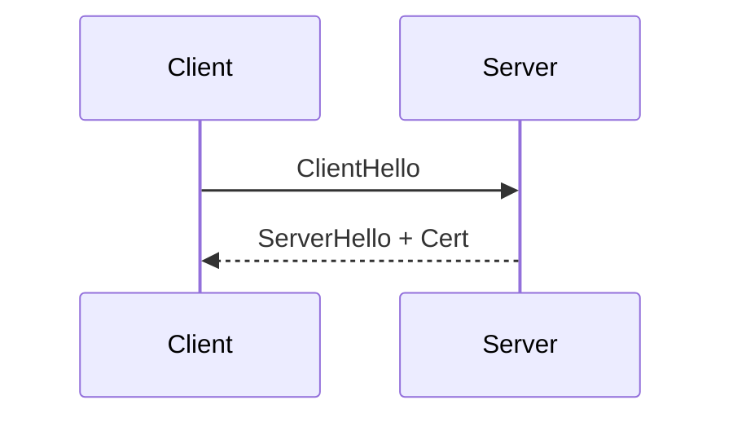

# Contributing to EduHub

Thanks for considering a contribution. This guide is the single source of truth
for **how to add or edit content** without breaking the site's taxonomy, search,
or build. Read the relevant section, then open a pull request.

> **TL;DR.** Find the right folder under `docs/{institution}/{program}/{level}/{subject}/{material-type}/`,
> copy `docs/_templates/note-template.mdx`, fill in the frontmatter, write the
> content, open a PR. CI will catch the rest.

---

## 1. Taxonomy

Every file under `docs/` follows the same five-level path:

```
docs/{institution}/{program}/{level}/{subject}/{material-type}/{file}.mdx
                                                        └── optional sub-folder
```

| Level             | Allowed values                                                                                                | Example         |
| ----------------- | ------------------------------------------------------------------------------------------------------------- | --------------- |
| **institution**   | `ioe`, `ctevt`, `tu`, `pu`, `ku`                                                                              | `ioe`           |
| **program**       | `msncs`, `mscske`, `bct`, `bce`, `bel`, `bex`, `bme`, `bge`, `diploma-computer`, `diploma-civil`, `bsc-csit`… | `msncs`         |
| **level**         | `year-1-part-1` … `year-4-part-2`, or `semester-1` … `semester-8` for CTEVT                                   | `year-1-part-1` |
| **subject**       | kebab-case subject slug                                                                                       | `cryptography`  |
| **material-type** | `notes`, `labs`, `past-papers`, `slides`, `projects`, `references`                                            | `notes`         |

A subject **must** contain an `index.mdx` that introduces it, links the syllabus
checklist (`<ProgressTracker>`), and lists companion `<ResourceCard>` files.

### Naming files

- **Chapter notes** — `NN-kebab-slug.mdx` where NN is a zero-padded chapter number.
  Example: `03-hash-functions.mdx`.
- **Past papers** — `YYYY-paper-slug.mdx`. ISO year, then a short slug.
  Example: `2079-regular.mdx`, `2080-back.mdx`.
- **Lab manuals** — `lab-NN-slug.mdx`. Example: `lab-02-rsa-keygen.mdx`.
- **Slides** — `slides-NN-slug.mdx`.

### Categories (`_category_.json`)

Every directory that should appear in the sidebar needs a `_category_.json`
controlling its label and ordering:

```json
{
  "label": "Cryptography & Data Security",
  "position": 2,
  "collapsed": true,
  "link": { "type": "doc", "id": "ioe/msncs/year-1-part-1/cryptography/index" }
}
```

For section landing pages (no concrete `index.mdx`) use:

```json
{
  "link": {
    "type": "generated-index",
    "title": "…",
    "description": "…",
    "slug": "/…"
  }
}
```

---

## 2. Frontmatter

Every `.mdx` page **must** have this frontmatter block:

```yaml
---
title: 'Page title shown as H1 and tab title'
sidebar_label: 'Short label for the sidebar' # optional but recommended
sidebar_position: 3 # numeric; lower = higher
description: 'One-sentence SEO + social-card description, ~140 chars.'
slug: /ioe/msncs/year-1-part-1/cryptography/notes/ch03
tags: [msncs, year-1-part-1, enctns502, chapter, notes]
last_update:
  date: 2026-05-21
  author: Your Name
---
```

### Why a custom `slug`?

The default Docusaurus slug is derived from the folder + filename, which is
ugly (`ioe/msncs/year-1-part-1/cryptography/notes/03-hash-functions`). The custom
slug keeps URLs short, semantic, and stable when files are renamed.

---

## 3. MDX cheatsheet

The following components are **globally registered** — no import needed.

### `<ResourceCard>`

```mdx
<ResourceCard
  title="Cryptography — 2079 Past Paper"
  description="Regular 2079 attempt — covers DES, RSA, PKI."
  file="/files/ioe/msncs/i-i/cryptography/past-papers/2079.pdf"
  type="pdf" // pdf | doc | slide | code | dataset | image | video | link
  tags={['PAST PAPER', '2079']}
  size="412 KB"
  pages={4}
  inlineView // renders an in-page iframe preview button
/>
```

### `<ProgressTracker>`

A LocalStorage-backed syllabus checklist. Use one per subject syllabus page.

```mdx
<ProgressTracker
  storageKey="msncs/i-i/cryptography/syllabus"
  title="Cryptography — chapter checklist"
  items={[
    { id: 'ch1', label: 'Ch 1 — Intro to Cryptography', hours: 6 },
    { id: 'ch2', label: 'Ch 2 — Symmetric & Asymmetric', hours: 12 },
  ]}
/>
```

> The `storageKey` is permanent — **do not rename it without a migration plan**,
> or students lose their tick-state silently. If you must rename, leave a note
> in the PR so the maintainer can write a one-time `localStorage` migration.

### `<SidebarItem>` and `<SidebarItemList>`

For program / subject index pages.

```mdx
<SidebarItemList title="Semester I">
  <SidebarItem
    href="/ioe/msncs/year-1-part-1/cryptography"
    title="Cryptography & Data Security"
    code="ENCTNS502"
    meta="4 cr · 62 hrs"
    badge="CORE"
    description="Symmetric/asymmetric crypto, hash functions, PKI…"
  />
</SidebarItemList>
```

### `<AddToBundleButton>`

Drop anywhere — usually at the top of an index page — to give readers a one-tap
way to add the current page to their bundle. With no props it uses the current
URL automatically:

```mdx
<AddToBundleButton />
```

To add a _different_ page (e.g. from a syllabus index linking to a chapter),
pass an explicit `slug`:

```mdx
<AddToBundleButton slug="/ioe/msncs/year-1-part-1/cryptography/notes/ch03" />
```

This component is also injected automatically into the footer of every doc
page via the [`DocItem/Footer` swizzle](./src/theme/DocItem/Footer/) — you
don't need to add it to chapter notes by hand.

### `<ReadingTime>`

A short "~12 min read" tag. Counts words in the live article DOM, so it works
on any rendered MDX. Auto-mounted in the doc footer; rarely needed inline.

```mdx
<ReadingTime /> {/* default 220 wpm */}
<ReadingTime wpm={260} /> {/* heavier reader */}
```

### Math (KaTeX)

Inline: `$ E = mc^2 $`. Display: `$$ \sum_{i=1}^n a_i $$`.

### Admonitions

```mdx
:::tip Pro tip
Use the search bar (⌘ K) instead of clicking through.
:::

:::warning Exam-relevant
Past-paper coverage is heaviest on Ch 2 and Ch 4.
:::
```

### Diagrams (Mermaid)

````mdx

````

---

## 3a. Feature flags (toggling site behaviour without code changes)

Every reader-facing affordance below is wired through `customFields.features` in
[`docusaurus.config.js`](./docusaurus.config.js). Flip any to `false` to
silently disable the component (it renders `null`):

```js
customFields: {
  features: {
    bundleBuilder:   true,   // multi-chapter combine + download
    focusMode:       true,   // Shift+F to hide chrome
    progressTracker: true,   // LocalStorage syllabus checklists
    scrollProgress:  true,   // hairline bar under navbar
    keyboardHelp:    true,   // press ? for the shortcuts modal
    readingTime:     true,   // auto-mounted "~N min read" tag
  },
},
```

Use this to test in isolation, to ship a minimal "exam mode" build, or to
disable a feature during a maintenance window.

## 3b. Keyboard shortcuts (reader-facing)

| Shortcut         | Action                            |
| ---------------- | --------------------------------- |
| `⌘ K` / `Ctrl K` | Open search                       |
| `Shift + F`      | Toggle Focus Mode                 |
| `?`              | Open the keyboard-shortcut modal  |
| `Esc`            | Close Focus Mode / shortcut modal |

The shortcuts modal lists everything reader-facing. Add a row to
[`KeyboardHelp/index.jsx`](./src/components/KeyboardHelp/index.jsx) when you
ship a new shortcut.

## 4. Adding static files (PDF, DOCX, ZIP)

Upload to `static/files/{institution}/{program}/{level}/{subject}/{material-type}/`,
mirroring the docs taxonomy. The path becomes the URL: a file at
`static/files/ioe/msncs/i-i/cryptography/past-papers/2079.pdf` is reachable at
`/files/ioe/msncs/i-i/cryptography/past-papers/2079.pdf`.

**Size limit.** Keep individual files under **10 MB**. For larger assets, host
on GitHub Releases or external storage and link via `<ResourceCard type="link">`.

---

## 5. Running the site locally

```bash
npm ci
npm run start         # http://localhost:3000
npm run build         # production build
npm run serve         # serve the production build
```

Hot-reload covers Markdown, MDX, CSS, and JSX changes. Sidebar / category JSON
edits require a restart (Docusaurus reads them at boot).

---

## 6. Pull request checklist

Before requesting review, confirm:

- [ ] File is in the right taxonomy folder.
- [ ] Frontmatter is complete (`title`, `description`, `slug`, `tags`, `last_update`).
- [ ] No broken links (CI catches site-internal ones; check external manually).
- [ ] If you added a `_category_.json`, you set `position` and `label`.
- [ ] If you added a `<ProgressTracker>`, the `storageKey` is stable.
- [ ] Static files (if any) land under `static/files/…` mirroring the doc path.
- [ ] Run `npm run build` locally — it must succeed.

CI runs `npm run build` on every PR; if it goes red, the deploy is blocked.

---

## 7. License

By contributing, you agree your work is released under **CC BY 4.0** (same
licence as the rest of the site). Third-party assets you redistribute must be
either: (a) under a compatible licence and attributed inline, or (b) replaced
by a link to the legitimate source.
