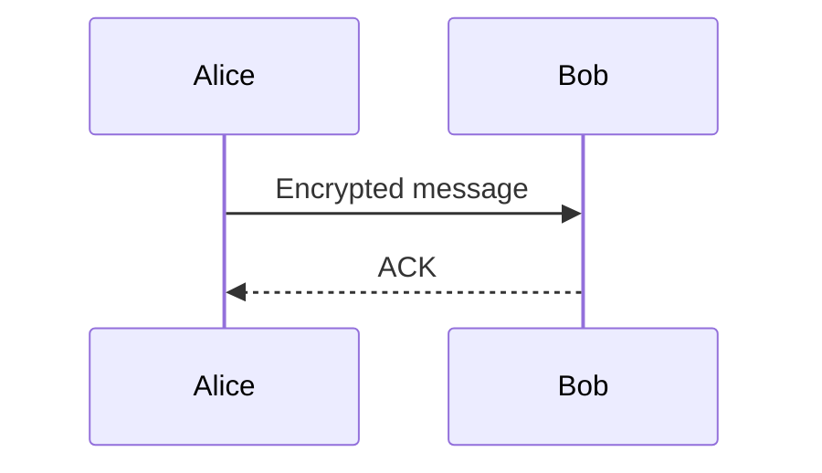

---
# Copy this file when adding a new chapter note. Replace every placeholder.
title: "Chapter N — Topic name"
sidebar_label: "Ch NN — Topic"
sidebar_position: 1
description: "One-sentence summary — used by search engines and social previews."
slug: /<institution>/<program>/<level>/<subject>/notes/ch01
tags: [<program>, <level>, <subject-code>, chapter, notes]
last_update:
  date: 2026-01-01
  author: Your Name
---

> **Subject:** `<Subject Title>` (`<CODE>`) · **Hours:** N

A one-paragraph orientation: what is this chapter about, why does it matter,
what the reader will be able to do after reading it. Avoid bullet lists here;
prose carries the reader in.

## N.1 Section title

Body text. Use prose with embedded definitions:

> **Term-of-art** — short, precise definition. Limit to ~25 words.

Inline math like $a^2 + b^2 = c^2$ renders via KaTeX. Display math:

$$
\nabla \cdot \mathbf{E} = \frac{\rho}{\varepsilon_0}
$$

### N.1.1 Sub-section

Keep sub-sections meaningful — if a topic only needs one paragraph, don't promote it to H3.

## N.2 Worked example or diagram

Use Mermaid for sequence / flow diagrams:



Or a code block for an algorithm:

```python
def hello(name: str) -> str:
    return f"Hello, {name}"
```

## N.3 Companion resources

import ResourceCard from '@site/src/components/ResourceCard';

<ResourceCard
  title="Reference paper or lab sheet"
  description="What the file is and why a student opens it."
  file="/files/<institution>/<program>/<level>/<subject>/references/sample.pdf"
  type="pdf"
  tags={['REFERENCE']}
  size="—"
  inlineView
/>

## Summary

A short closing paragraph that names the 3–5 takeaways without bulleting them.
Future-you will read this when revising — make it dense, not exhaustive.

## Further reading

1. *Author, Title*, Publisher, Year — chapter X.
2. [Web reference](https://example.com)
